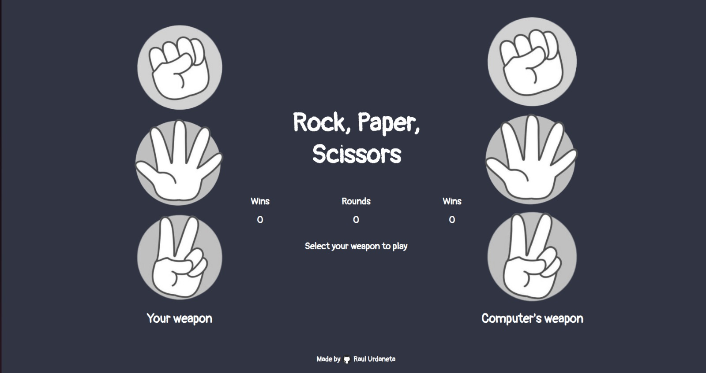

# rock, paper, scissors game

# Learnings
- declaring variables in Js.
- declaring variables with a query selector to get information about html objects.
- edited styles and text from Js code like disabling buttons, hiding them, hiding borders, scaling images and buttons, applying color filter to images.
- Made functional buttons with scaling and color filters when hover over them.
- Created my first Js functions.

[Live Preview] (https://raulurdanetag.github.io/rock-paper-scissors-games/) 👈
